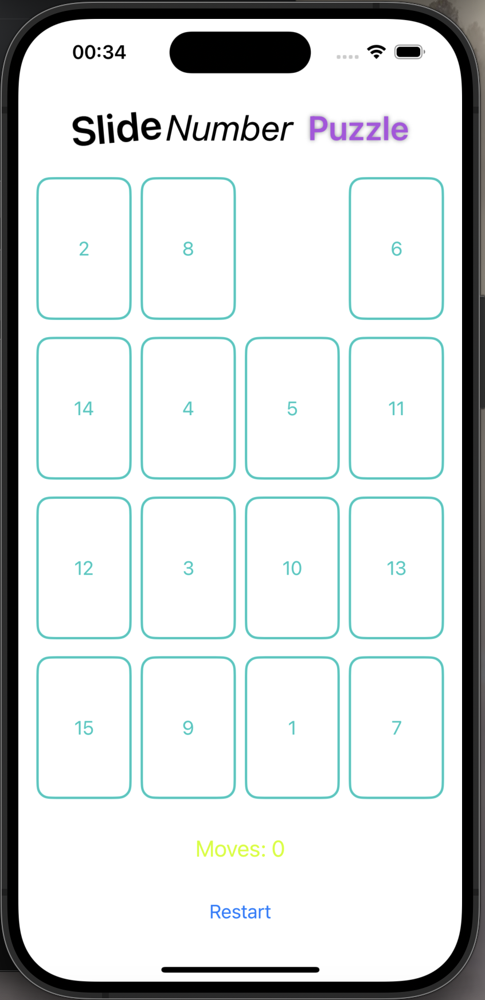
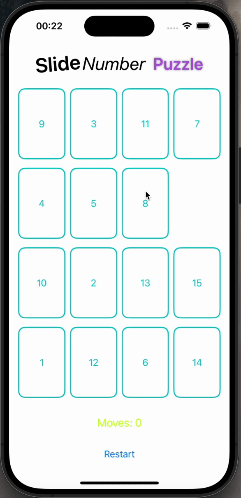
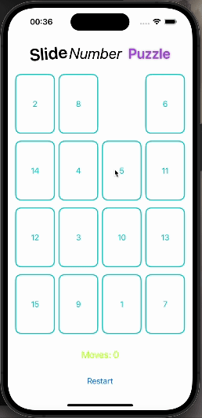
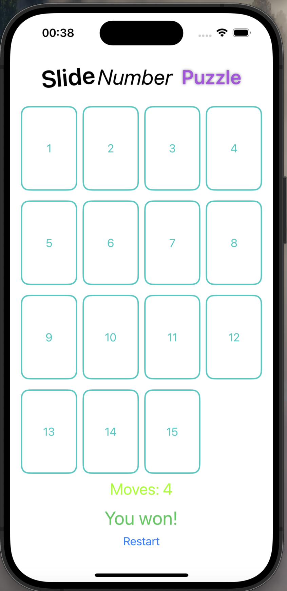

6410685033 Thammasat Thonggamgaew

# CN436_AS2: Slide Number Puzzle

An iOS Random Number Game  
[Demo Clip](https://youtu.be/Lvf4atB_YLw?si=ByzU4alaqxDDIV1b)

## Table of Contents

- [Slide Number Puzzle](#cn436_as2-slide-number-puzzle)
  - [Table of Contents](#table-of-contents)
  - [Objective](#objective)
  - [How to play](#how-to-play)
  - [Contact](#contact)

## Objective
This game is a classic puzzle where players rearrange numbered tiles to reach a specific order, typically from 1 to 15 with an empty space. By sliding tiles one at a time, players must solve the puzzle in the least number of moves possible. It provides a fun and challenging way to exercise logical thinking and problem-solving skills.

### How to play

- In the beginning, you'll see numbered tiles arranged in seemingly random order, with one empty space.

- **Select a tile:** Tap on any tile adjacent to the empty space.

- **Slide the tile:** The selected tile will move into the empty space, creating a new empty space in its previous position.

- **Continue sliding:** You can only slide tiles horizontally or vertically into the empty space. Repeat by selecting and sliding adjacent tiles until you reach the desired arrangement.

- **Congratulations!** You've solved the puzzle when all tiles are in their correct positions, **with the empty space in the bottom right corner.**

#### Tips and Strategies: (From Google Gemini)

- Plan your moves: Think ahead and visualize the path required to move each tile to its final position.
- Start with easily movable tiles: Prioritize moving tiles around the empty space to create more options.
- Utilize the empty space: Think of the empty space as a tool to move other tiles around.
- Practice and experiment: The more you play, the better you'll understand the puzzle's mechanics and develop your own strategies.
- Enjoy the challenge! Don't get discouraged if it takes time to solve. The puzzle is designed to be a fun and engaging brain teaser.

### Contact
- Thammasat Thonggamgaew (Pond)
- Tel: (+66) 087 704 4428
- Email: pond.thammasat@gmail.com
- University Email: thammasat.tho@dome.tu.ac.th
- Faculty Email: 6410685033@student.tu.ac.th